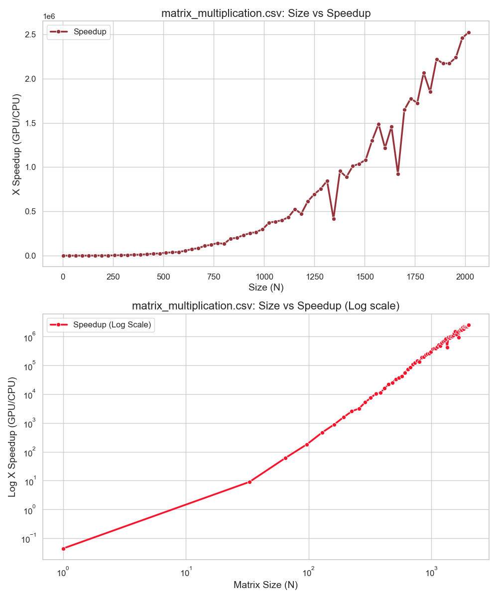
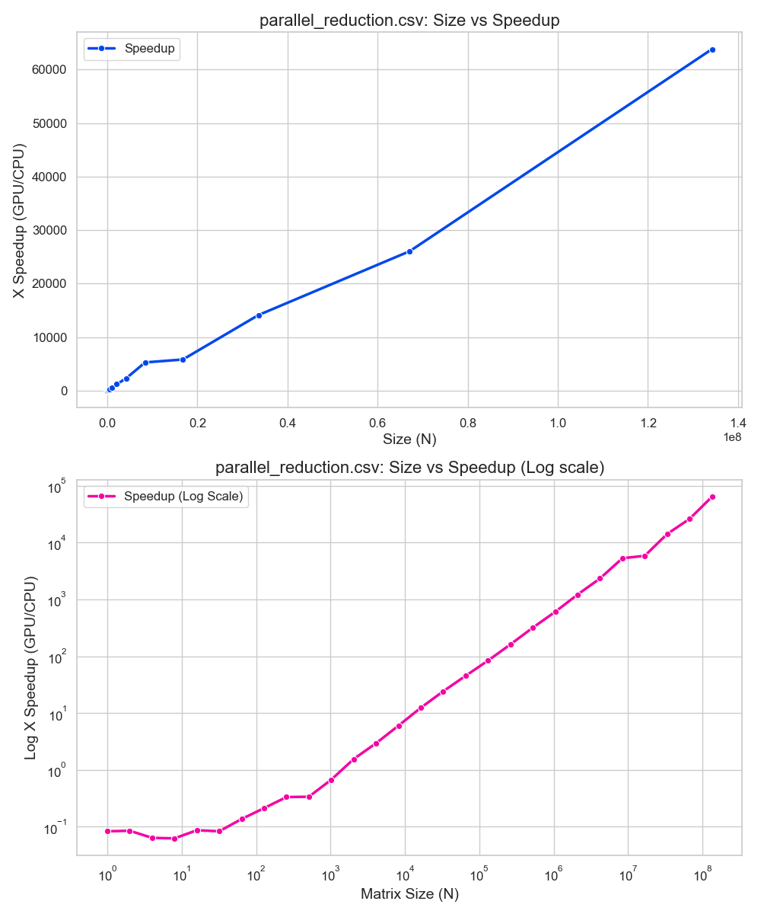
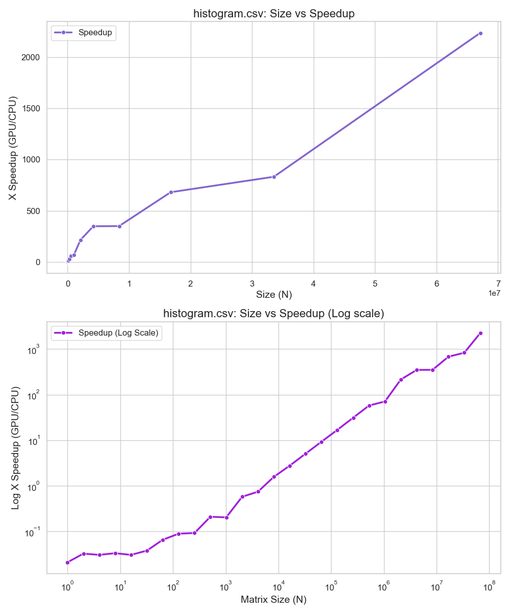

# Analyzing GPU Speedup on NVIDIA Jetson
By Parth Raut

## Introduction
This fun project involved running various algorithms and comparing the computational time to compute these on CPU vs GPU. Run on my personal NVIDIA Jetson!

## Vector Addition
Objective: Perform element-wise addition of two large vectors (arrays).
Details: You have two arrays A and B of size N. You need to compute C = A + B.

### Results

## Matrix Multiplication
Objective: Implement matrix multiplication in CUDA (C = A * B), where A, B, and C are square matrices of size N x N.
Details: Write a CUDA kernel to compute the matrix multiplication. Remember, the value of each element C[i][j] is the dot product of the ith row of A and the jth column of B.
Optimize your kernel to make use of shared memory to reduce global memory accesses.

### Results

## Parallel Reduction
Objective: Implement a parallel reduction kernel to sum an array of numbers.
Details: Given an array A of size N, use parallel reduction to find the sum of all elements in A.
Implement a kernel that uses a tree-based approach for reduction. Start by having each thread load one element and then pair-wise add elements across threads, halving the number of active threads in each step.

### Results

## Histogram Computation
Objective: Compute a histogram of values in an array.
Details: Given an array A of integers (ranging from 0 to M-1) and its size N, compute the histogram of A. The histogram array H of size M should contain the counts of each integer in A (i.e., H[i] is the number of times i appears in A).

### Results

## 2D Convolution
Objective: Implement a simple 2D convolution kernel.
Details: Given a 2D input matrix (image) I of size NxN and a convolution filter (kernel) F of size 3x3, compute the output matrix (filtered image) O using 2D convolution.
For simplicity, assume the convolution is applied without padding (resulting in an output matrix of size (N-2)x(N-2)) and with a stride of 1.
Write a CUDA kernel to apply the convolution filter to the input matrix. Each thread should compute one element of the output matrix.
Consider how shared memory could be used to optimize memory accesses for this problem.

### Results
